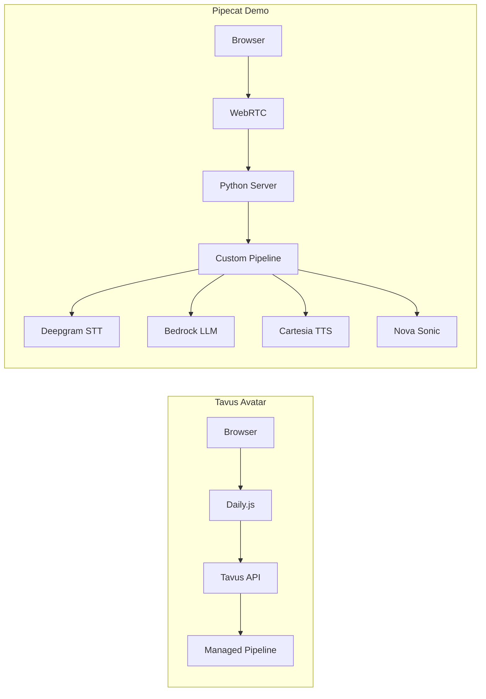
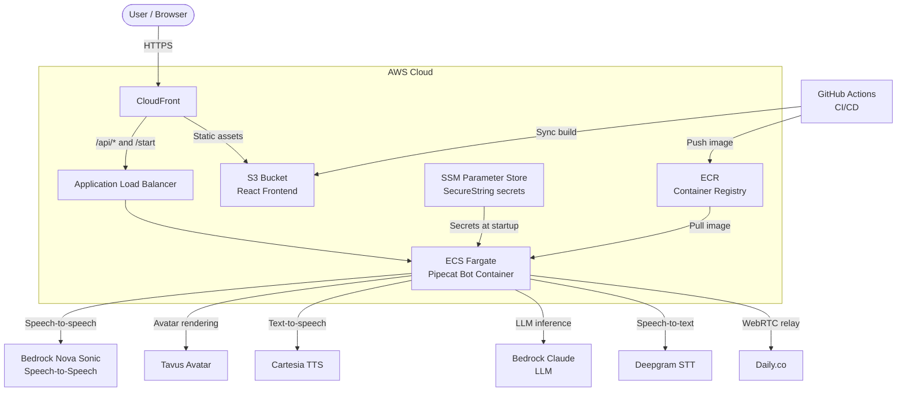

# Demo: Real-time Voice Agents with Video Avatar

An interactive conversational video demo for AWS events and demo booths. An AI-powered video avatar engages visitors in real-time voice conversations and can display content overlays (architecture diagrams, use cases) via tool calls. Supports configurable event contexts via the `EVENT_CONFIG` environment variable.

## Table of Contents

- [Quick Start](#quick-start)
- [Choose Your Implementation](#choose-your-implementation)
- [Run Tavus Avatar Demo](#run-tavus-avatar-demo)
- [Run Pipecat Demo](#run-pipecat-demo)
- [Browser Compatibility](#browser-compatibility)
- [Performance Considerations](#performance-considerations)
- [Security](#security)
- [Troubleshooting](#troubleshooting)
- [Monitoring & Debugging](#monitoring--debugging)
- [Advanced Topics](#advanced-topics)
  - [Available Tavus Avatars](#available-tavus-avatars)
- [Glossary](#glossary)

## Quick Start

**Fastest path to run each demo:**

```bash
# Tavus Avatar (managed pipeline)
cd tavus-avatar && npm run dev:all

# Pipecat (self-hosted pipeline)  
cd tavus-pipecat-example && npm run dev:all
```

## Choose Your Implementation

This repo contains two independent implementations of the same demo:

| | `tavus-avatar/` | `tavus-pipecat-example/` |
|---|---|---|
| **Approach** | Tavus hosted CVI¹ | Self-hosted Pipecat pipeline |
| **Frontend** | Next.js + Daily.js | React + WebRTC |
| **Backend** | Next.js API routes → Tavus API | Python Pipecat server |
| **Pipeline control** | Tavus orchestrates STT²/LLM³/TTS⁴ | You orchestrate everything in Python |
| **Pipeline modes** | Single (Tavus-managed cascaded) | Cascaded + Amazon Nova Sonic toggle |
| **When to choose** | Quick demos, minimal setup, managed infrastructure | Custom pipelines, multi-model support, full control |
| **Best for** | Prototyping, simple use cases | Production, complex workflows, experimentation |

Both share the same tool definitions and content overlays. System prompts are isolated per event in `prompts/{EVENT_CONFIG}/`.



---

## Run Tavus Avatar Demo

A Next.js app that delegates pipeline orchestration to Tavus. You configure the persona, STT²/LLM³/TTS⁴ engines, and tools via the Tavus API. Daily.js handles the WebRTC transport.

### Prerequisites

- Node.js 18+ and npm
- A Tavus account with an API key and configured persona

### Set Up Environment

```bash
cd tavus-avatar
npm install
cp env.example .env.local
```

Example `.env.local`:
```bash
TAVUS_API_KEY=your_tavus_api_key_here
TAVUS_PERSONA_ID=your_persona_id_here
```

### Start Development Server

```bash
# All-in-one command
npm run dev:all

# Or step by step
npm run dev
curl -X POST http://localhost:3000/api/persona/setup-tools
```

Open [http://localhost:3000](http://localhost:3000).

### Validate Environment

```bash
# Check API key and persona
curl -H "x-api-key: $TAVUS_API_KEY" \
  "https://tavusapi.com/v2/personas/$TAVUS_PERSONA_ID"
```

### Pipeline Architecture

Uses a cascaded pipeline orchestrated by Pipecat inside Tavus:

**Audio In → Noise Cancellation (local) → VAD⁵ → STT² → LLM³ → TTS⁴ → Audio Out**

| Layer | Engine | Role |
|---|---|---|
| Noise Cancellation | [Krisp](https://krisp.ai) (local macOS) | Filters background noise via a virtual microphone device |
| VAD⁵ | Tavus Sparrow | Turn-taking and interruption detection |
| STT² | `tavus-advanced` (via Tavus) | Real-time speech-to-text |
| LLM³ | `tavus-gpt-oss` (via Tavus) | Reasoning and response generation |
| TTS⁴ | `sonic-3` (Cartesia via Tavus) | Natural-sounding speech synthesis |

STT²/TTS⁴ engines are managed within Tavus. See [Update Tavus Persona](#update-tavus-persona) for details.

---

## Run Pipecat Demo

A Python Pipecat server with a React frontend. You control the full pipeline in code. Supports two pipeline modes that visitors can toggle at the kiosk:

- **Cascaded**: Deepgram STT² → Bedrock Claude → Cartesia TTS⁴ (best-of-breed at each layer)
- **Nova Sonic**: Amazon Nova 2 Sonic speech-to-speech on Bedrock (single model, 15 languages)

Both modes use Tavus for avatar rendering and Pipecat for orchestration.

### Prerequisites

- Python 3.11+
- Node.js 18+ and npm
- API keys: Deepgram, Cartesia, Tavus, AWS credentials (for Bedrock)

### Set Up Environment

```bash
cd tavus-pipecat-example

# Backend
python -m venv env && source env/bin/activate
pip install -r requirements.txt
cp .env.example .env
```

Example `.env`:
```bash
DEEPGRAM_API_KEY=your_deepgram_key_here
CARTESIA_API_KEY=your_cartesia_key_here
TAVUS_API_KEY=your_tavus_key_here
TAVUS_REPLICA_ID=your_replica_id_here
TAVUS_REPLICA_ID_NOVA_SONIC=your_nova_sonic_replica_id_here
AWS_REGION_NOVA_SONIC=ap-south-1
NOVA_SONIC_VOICE_ID=matthew
CARTESIA_VOICE_ID=79a125e8-cd45-4c13-8a67-188112f4dd22
AWS_ACCESS_KEY_ID=your_aws_key_here
AWS_SECRET_ACCESS_KEY=your_aws_secret_here
```

### Start Development Server

```bash
# All-in-one command
npm run dev:all

# Or step by step
python tavus-pipecat.py --transport webrtc --host 0.0.0.0 --port 7860 &
cd frontend && npm start
```

Open [http://localhost:3000](http://localhost:3000). Click **Start demo**, choose a pipeline mode, and begin.

### Validate Environment

```bash
# Test API keys
curl -H "Authorization: Token $DEEPGRAM_API_KEY" \
  "https://api.deepgram.com/v1/projects"

curl -H "X-API-Key: $CARTESIA_API_KEY" \
  "https://api.cartesia.ai/voices"

aws bedrock list-foundation-models --region $AWS_REGION_NOVA_SONIC
```

### Pipeline Architecture

**Cascaded mode:**
```
Audio In -> Deepgram Nova 3 STT -> Bedrock Claude LLM -> Cartesia TTS -> Tavus Avatar -> Audio/Video Out
```

**Nova Sonic mode:**
```
Audio In -> Amazon Nova 2 Sonic (STT+LLM+TTS) -> Tavus Avatar -> Audio/Video Out
```

### Environment Variables

| Variable | Description |
|---|---|
| `DEEPGRAM_API_KEY` | Deepgram API key (cascaded STT²) |
| `CARTESIA_API_KEY` | Cartesia API key (cascaded TTS⁴) |
| `TAVUS_API_KEY` | Tavus API key (avatar) |
| `TAVUS_REPLICA_ID` | Tavus replica ID for cascaded mode (see [Available Avatars](#available-tavus-avatars)) |
| `TAVUS_REPLICA_ID_NOVA_SONIC` | Tavus replica ID for Nova Sonic mode — use a different avatar to visually distinguish the two modes |
| `DAILY_API_KEY` | Daily.co API key (required for cloud deployment with Daily transport) |
| `REACT_APP_TRANSPORT` | WebRTC transport (`daily` or `webrtc`). Set automatically by CI/CD — not user-configured. |
| `AWS_REGION_NOVA_SONIC` | AWS region for Nova Sonic (default: `ap-south-1`) |
| `NOVA_SONIC_VOICE_ID` | Nova Sonic voice ID (default: `matthew`; use `arjun` for Hindi) |
| `CARTESIA_VOICE_ID` | Cartesia voice UUID (default: `79a125e8-...` British Lady) |
| `AWS_ACCESS_KEY_ID` | AWS credentials (optional if using default credential chain) |
| `AWS_SECRET_ACCESS_KEY` | AWS credentials (optional if using default credential chain) |

### Deploying to AWS

The Pipecat demo deploys to AWS with a GitHub Actions CI/CD pipeline that triggers **only** on changes to `tavus-pipecat-example/` or `prompts/`.

**Architecture:**
- **Backend**: ECS Fargate (Docker container) behind an ALB
- **Frontend**: S3 + CloudFront (static React build)
- **CloudFront**: Serves frontend and proxies `/api/*` to the ALB (single HTTPS domain)
- **Secrets**: SSM Parameter Store (SecureString)
- **Transport**: Daily.js for cloud (reliable WebRTC relay), SmallWebRTC for local dev



#### 1. Store API keys in SSM Parameter Store

```bash
aws ssm put-parameter --name /tavus-pipecat/DEEPGRAM_API_KEY --type SecureString --value "your-key"
aws ssm put-parameter --name /tavus-pipecat/CARTESIA_API_KEY --type SecureString --value "your-key"
aws ssm put-parameter --name /tavus-pipecat/TAVUS_API_KEY --type SecureString --value "your-key"
aws ssm put-parameter --name /tavus-pipecat/TAVUS_REPLICA_ID --type SecureString --value "your-replica-id"
aws ssm put-parameter --name /tavus-pipecat/TAVUS_REPLICA_ID_NOVA_SONIC --type SecureString --value "your-replica-id"
aws ssm put-parameter --name /tavus-pipecat/DAILY_API_KEY --type SecureString --value "your-daily-api-key"
```

#### 2. Deploy infrastructure (one-time)

```bash
aws cloudformation deploy \
  --template-file tavus-pipecat-example/infra/template.yaml \
  --stack-name tavus-pipecat \
  --parameter-overrides \
    VpcId=vpc-xxx \
    PublicSubnetIds=subnet-aaa,subnet-bbb \
  --capabilities CAPABILITY_NAMED_IAM
```

Note the outputs — you'll need them for GitHub Actions secrets.

#### 3. Set up GitHub Actions OIDC

Create a GitHub OIDC identity provider and IAM role so GitHub Actions can assume credentials without static keys:

```bash
# Create OIDC provider (one-time per account)
aws iam create-open-id-connect-provider \
  --url https://token.actions.githubusercontent.com \
  --client-id-list sts.amazonaws.com \
  --thumbprint-list 6938fd4d98bab03faadb97b34396831e3780aea1

# Create IAM role with trust policy for your repo, then attach
# ECR, ECS, S3, and CloudFront permissions (see infra/template.yaml)
```

#### 4. Configure GitHub Actions secrets

| Secret | Value (from CloudFormation outputs) |
|---|---|
| `AWS_ROLE_ARN` | IAM role ARN for GitHub Actions OIDC |
| `S3_BUCKET_NAME` | `FrontendBucketName` output |
| `CLOUDFRONT_DISTRIBUTION_ID` | `CloudFrontDistributionId` output |

Also set these **repository variables** (Settings → Variables → Actions) to configure the event and voices per deployment:

| Variable | Example (Sydney) | Example (Bengaluru) |
|---|---|---|
| `AWS_REGION` | `ap-southeast-2` | `ap-south-1` |
| `EVENT_CONFIG` | `aws-summit-sydney-2026` | `aws-summit-bengaluru-2026` |
| `NOVA_SONIC_VOICE_ID` | `matthew` | `arjun` |
| `CARTESIA_VOICE_ID` | `79a125e8-cd45-4c13-8a67-188112f4dd22` | `7f423809-0011-4658-ba48-a411f5e516ba` |

#### 5. Push to deploy

The workflow at `.github/workflows/deploy-pipecat.yml` runs automatically on push to `main` when files in `tavus-pipecat-example/` or `prompts/` change. It:

1. Builds the Docker image and pushes to ECR
2. Forces a new ECS Fargate deployment and waits for stability
3. Builds the React frontend (with `REACT_APP_API_URL=''` for same-origin CloudFront)
4. Syncs to S3 and invalidates the CloudFront cache

The frontend and backend deploy in parallel. Access the demo at the CloudFront domain (`CloudFrontDomainName` output).

> **Note:** Regenerate `frontend/package-lock.json` with Node 20 (`fnm use 20 && npm install`) to match CI. The first CloudFormation deploy is slow (~15 min) as the ECS service waits for a Docker image — subsequent deploys via CI/CD are faster.

---

## Browser Compatibility

**Supported Browsers:**
- Chrome 88+ (recommended)
- Firefox 85+
- Safari 14.1+
- Edge 88+

**WebRTC Requirements:**
- Secure context (HTTPS or localhost)
- Microphone permissions
- WebRTC support (enabled by default in modern browsers)

**Known Issues:**
- Safari may require user gesture before audio playback
- Firefox requires `media.navigator.permission.disabled=true` for localhost development

---

## Performance Considerations

**Latency Optimization:**
- **Tavus Avatar**: ~200-400ms end-to-end latency (managed pipeline)
- **Pipecat Cascaded**: ~300-500ms (Deepgram + Bedrock + Cartesia)
- **Nova Sonic**: ~400-600ms (single model, higher quality)

**Concurrent Users:**
- **Local Development**: 1-2 concurrent sessions
- **AWS Deployment**: 10-50 concurrent sessions (auto-scaling ECS)
- **Resource Usage**: ~1GB RAM, 0.5 CPU per active session

**Optimization Tips:**
- Use Daily.js transport for production (better WebRTC handling)
- Enable Krisp noise cancellation for cleaner audio input
- Monitor ECS CPU/memory metrics for scaling decisions

---

## Security

**API Key Management:**
- Store keys in environment variables, never in code
- Use AWS SSM Parameter Store (SecureString) for production
- Rotate keys regularly and monitor usage

**CORS Configuration:**
```javascript
// Next.js API routes
const corsHeaders = {
  'Access-Control-Allow-Origin': process.env.NODE_ENV === 'production' 
    ? 'https://your-domain.com' 
    : '*',
  'Access-Control-Allow-Methods': 'GET, POST, OPTIONS',
  'Access-Control-Allow-Headers': 'Content-Type, Authorization'
}
```

**Rate Limiting:**
- Implement per-IP session limits
- Use AWS WAF for DDoS protection
- Monitor API usage and set billing alerts

---

## Troubleshooting

### Microphone Permissions

**Chrome/Edge:**
1. Click the microphone icon in the address bar
2. Select "Always allow" for the site
3. Refresh the page

**Firefox:**
1. Click the shield icon → Permissions → Microphone
2. Select "Allow" and check "Remember this decision"

**Safari:**
1. Safari → Settings → Websites → Microphone
2. Set your site to "Allow"

### API Key Validation

```bash
# Tavus
curl -H "x-api-key: $TAVUS_API_KEY" "https://tavusapi.com/v2/personas"

# Deepgram
curl -H "Authorization: Token $DEEPGRAM_API_KEY" "https://api.deepgram.com/v1/projects"

# Cartesia
curl -H "X-API-Key: $CARTESIA_API_KEY" "https://api.cartesia.ai/voices"

# AWS Bedrock
aws bedrock list-foundation-models --region us-east-1
```

### WebRTC Connection Issues

**Symptoms:** No audio/video, connection timeouts
**Solutions:**
1. Check browser console for WebRTC errors
2. Verify HTTPS/localhost secure context
3. Test with different networks (corporate firewalls may block WebRTC)
4. Use Daily.js transport for better NAT traversal

### CORS Problems

**Symptoms:** Network errors, blocked requests
**Solutions:**
1. Check browser console for CORS errors
2. Verify API endpoints allow your domain
3. For local development, use `--disable-web-security` flag (Chrome only)
4. Ensure proper CORS headers in API responses

---

## Monitoring & Debugging

**Logging:**
```bash
# Pipecat server logs
python tavus-pipecat.py --log-level DEBUG

# Browser console
# Check Network tab for API calls
# Check Console for WebRTC errors
```

**Health Checks:**
```bash
# Tavus Avatar
curl http://localhost:3000/api/health

# Pipecat
curl http://localhost:7860/health
```

**AWS CloudWatch:**
- ECS service metrics (CPU, memory, task count)
- ALB target health and response times
- CloudFront cache hit rates and errors

---

## Advanced Topics

### Update Tavus Persona

For `tavus-avatar` only. The persona's system prompt, tools, and engines are managed via the Tavus API.

#### Update the system prompt

```bash
# Set EVENT_CONFIG to match your event (e.g. aws-summit-bengaluru-2026)
SYSTEM_PROMPT=$(python3 -c "import json; print(json.dumps(open('prompts/$EVENT_CONFIG/system-instruction.md').read()))")

curl -X PATCH "https://tavusapi.com/v2/personas/$TAVUS_PERSONA_ID" \
  -H "x-api-key: $TAVUS_API_KEY" \
  -H "Content-Type: application/json" \
  -d "[{\"op\": \"replace\", \"path\": \"/system_prompt\", \"value\": $SYSTEM_PROMPT}]"
```

#### Sync tool definitions

```bash
curl -X POST "http://localhost:3000/api/persona/setup-tools"
```

#### Change STT²/TTS⁴ engines

```bash
curl -X PATCH "https://tavusapi.com/v2/personas/$TAVUS_PERSONA_ID" \
  -H "x-api-key: $TAVUS_API_KEY" \
  -H "Content-Type: application/json" \
  -d '[{"op": "replace", "path": "/layers/stt/stt_engine", "value": "tavus-advanced"}]'
```

### Electron Kiosk Shell

The `agent-kiosk-shell/` directory contains a generic Electron wrapper for running either demo in a borderless full-screen kiosk window. It appends `autostart=1&shell=electron` so sessions start immediately.

```bash
cd agent-kiosk-shell
npm install
cp .env.example .env

# Local dev
npm start -- --target-url=http://localhost:3000

# Deployed app
npm start -- --target-url=https://your-app.vercel.app --display-number=2
```

**Keyboard shortcuts:**
- `Cmd+R` — Reload
- `Cmd+B` — Show disconnected screen
- `Cmd+Q` — Quit

### Noise Cancellation

Noise cancellation runs locally on the kiosk Mac using [Krisp](https://krisp.ai), not inside the pipeline:

1. Install the [Krisp desktop app](https://krisp.ai).
2. Enable Noise Cancellation for the microphone.
3. In macOS System Settings → Sound → Input, select **Krisp Microphone**.
4. The browser uses the Krisp virtual mic automatically.

### Shared Resources

#### System Prompt

Both implementations load the system prompt from `prompts/{EVENT_CONFIG}/system-instruction.md`. Set `EVENT_CONFIG` to the event directory name (e.g. `aws-summit-bengaluru-2026`) to switch event context — prompts, greetings, voice IDs, and content items are all isolated per event. Copy `prompts/_template/` to add a new event.

#### Tool Calls

Both implementations support three tools:

- **show_content** — Display content overlays (architecture diagram, voice AI overview, use cases)
- **show_schedule** — Show summit schedule as markdown tables
- **dismiss_content** — Return to full-screen avatar view

#### Content Pages

Static HTML content pages are served from `tavus-pipecat-example/frontend/public/content/` and `tavus-avatar/src/app/content/`.

### Usage

1. Click **Start demo** on the landing page.
2. Grant microphone permissions when prompted.
3. Speak with the AI avatar in real-time.
4. Ask the avatar to show content (e.g., "show me the architecture diagram").
5. Press **End** or **Escape** to end the session.

**Keyboard shortcuts:**
- `Ctrl+D` — Toggle microphone mute
- `Ctrl+F` — Cycle microphone devices (tavus-avatar only)
- `Ctrl+G` — Cycle speaker devices (tavus-avatar only)

### Available Tavus Avatars

Tavus provides stock replicas usable without custom recordings. Set `TAVUS_REPLICA_ID` and `TAVUS_REPLICA_ID_NOVA_SONIC` in SSM Parameter Store to change the avatar per deployment.

**Female replicas:**

| Name | Replica ID | Setting |
|---|---|---|
| Olivia | `rc2146c13e81` | Neutral background |
| Olivia - Office | `r9fa0878977a` | Office setting |
| Anna | `r6ae5b6efc9d` | Neutral background |
| Anna - Office | `r4dcf31b60e1` | Office setting |
| Julia | `rdc96ac37313` | Neutral background |
| Julia - Home Office | `rb43357fb2ee` | Home office |
| Gloria - Conversational | `rbe2c395e725` | Conversational style |
| Rose | `r1af76e94d00` | Neutral background |
| Luna | `r9d30b0e55ac` | Neutral background |
| Helen - Casual | `r12d3eb75ec2` | Casual setting |
| Lucy - Studio | `r53a461095cf` | Studio setting |
| Samantha - Office V2 | `r38e4c3bc562` | Office setting |
| Gabby | `rdf61be0d4e1` | Neutral background |
| Ruby | `re3a705cf66a` | Neutral background |
| Destiny | `r38a383b0173` | Neutral background |
| Celine - Studio | `r4f5b5ef55c8` | Studio setting |

**Male replicas:**

| Name | Replica ID | Setting |
|---|---|---|
| Charlie | `rf4703150052` | Neutral background |
| Benjamin | `r1a4e22fa0d9` | Neutral background |
| Raj | `ra066ab28864` | Neutral background |
| Raj - Doctor | `r18e9aebdc33` | Doctor setting |
| Daniel - Office | `r72f7f7f7c8b` | Office setting |
| Owen | `r9458111c64a` | Neutral background |
| Carter | `rca8a38779a8` | Neutral background |
| Liam | `r90a0339d496` | Neutral background |
| Diego - Office V2 | `r044d76f4490` | Office setting |
| Danny | `r62baeccd777` | Neutral background |
| James | `r92debe21318` | Neutral background |
| Nathan - Bookshelf | `rfe12d8b9597` | Bookshelf setting |
| Lucas - Studio | `r5f0577fc829` | Studio setting |
| Victor - Casual | `r1d7cf9edbb4` | Casual setting |
| Kai | `r31e11adf1d3` | Neutral background |
| Zane | `r24efb3b9bef` | Neutral background |

**To update the avatar for a deployment:**
```bash
# Example: switch Sydney Nova Sonic to Olivia - Office
aws ssm put-parameter \
  --name /tavus-pipecat/TAVUS_REPLICA_ID_NOVA_SONIC \
  --type SecureString --value "r9fa0878977a" --overwrite \
  --region ap-southeast-2
```

**Current per-deployment config:**

| Deployment | Pipeline | Avatar | Voice |
|---|---|---|---|
| Sydney (`ap-southeast-2`) | Cascaded | Olivia (`rc2146c13e81`) | Cartesia British Lady |
| Sydney (`ap-southeast-2`) | Nova Sonic | Olivia - Office (`r9fa0878977a`) | olivia (Australian English) |
| Bengaluru (`ap-south-1`) | Cascaded | *(set in SSM)* | Cartesia Hindi |
| Bengaluru (`ap-south-1`) | Nova Sonic | *(set in SSM)* | arjun (Hindi) |

**Available Nova Sonic voices:** `matthew` (polyglot), `tiffany` (polyglot), `amy` (British English), `olivia` (Australian English), `ambre` (French), `beatrice` (Italian), `arjun` (Hindi), and others. See [Amazon Nova Sonic docs](https://docs.aws.amazon.com/nova/latest/userguide/nova-sonic-voice-options.html) for the full list.

### Guidance for Voice Agents

This demo promotes the [Guidance for Voice Agents on AWS](https://github.com/aws-samples/sample-voice-agent) reference architecture. Ask the avatar "show me the voice agent guidance" to display it.

---

## Glossary

- **CVI¹** — Conversational Video Interface: Real-time video avatar with voice interaction
- **STT²** — Speech-to-Text: Converts spoken audio to text transcription
- **LLM³** — Large Language Model: AI model for understanding and generating text responses
- **TTS⁴** — Text-to-Speech: Converts text responses to natural-sounding speech
- **VAD⁵** — Voice Activity Detection: Detects when user starts/stops speaking for turn-taking

---

## Project Structure

```
prompts/                          # Shared system prompts and knowledge base documents
agent-kiosk-shell/                # Generic Electron kiosk wrapper
tavus-avatar/                     # Tavus hosted CVI (Next.js)
  src/
    app/
      api/conversation/           # Create/end Tavus conversation sessions
      api/persona/setup-tools/    # Patch persona tool definitions
      content/                    # Embeddable overlay pages
    components/                   # React components
    lib/                          # Tavus API client, persona/tool configs
    types/                        # TypeScript type definitions
tavus-pipecat-example/            # Self-hosted Pipecat pipeline (Python + React)
  tavus-pipecat.py                # Pipecat bot (dual pipeline: cascaded + Nova Sonic)
  requirements.txt                # Python dependencies
  frontend/                       # React frontend
    src/
      components/                 # VideoConversation UI
      webrtc-client.js            # WebRTC client
    public/
      content/                    # Static content overlay pages
```

## Future Improvements

See [IMPROVEMENTS.md](IMPROVEMENTS.md) for tracked enhancements.

## Tech Stack

- **tavus-avatar**: Next.js 16 / React 19 / TypeScript / Tailwind CSS v4 / Daily.js / Tavus API
- **tavus-pipecat-example**: Python / Pipecat / Deepgram / Cartesia / Amazon Bedrock / Amazon Nova Sonic / Tavus / React
- **Shared**: Tavus avatar rendering, Pipecat orchestration, AWS infrastructure
